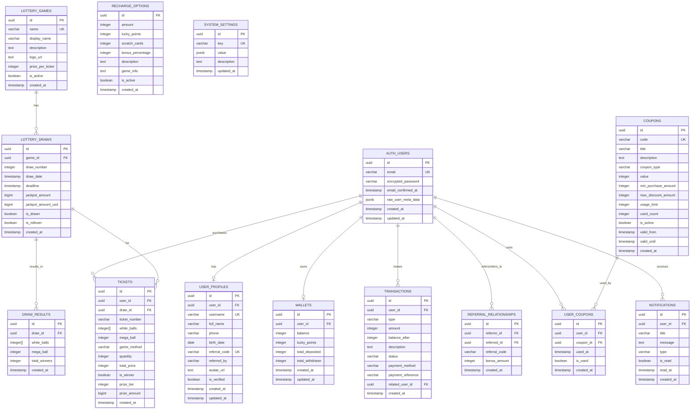

# Lucky Lotto Auth & Core Database ERD

## 핵심 테이블 구조 (Supabase 기반)



## 핵심 설계 원칙

### 1. Supabase Auth 통합
- **auth.users**: Supabase가 자동 관리하는 인증 테이블
- **user_profiles**: 사용자 추가 정보를 저장하는 확장 테이블
- **자동 프로필 생성**: 회원가입 시 트리거로 자동 생성

### 2. 사용자 식별 시스템
- **이메일**: Supabase Auth의 기본 식별자
- **username**: 사용자가 선택한 아이디 (4-30자 영문 소문자, 숫자)
- **referral_code**: 자동 생성되는 8자리 추천인 코드

### 3. 추천인 시스템
- **referral_code**: 각 사용자마다 고유한 추천 코드
- **referred_by**: 추천받은 코드 저장
- **referral_relationships**: 추천인-피추천인 관계 추적
- **자동 보너스**: 추천 시 양쪽 모두 5,000원 보너스

### 4. 지갑 시스템
- **balance**: 현재 잔액 (원 단위)
- **lucky_points**: 럭키 포인트
- **거래 추적**: 모든 입출금 내역 기록

### 5. 복권 시스템
- **lottery_games**: 게임 종류 (메가밀리언, 파워볼)
- **lottery_draws**: 회차별 추첨 정보
- **tickets**: 사용자별 구매 티켓
- **draw_results**: 추첨 결과

## 주요 기능

### 1. 회원가입 프로세스
```sql
-- 1. Supabase Auth로 사용자 생성
-- 2. 트리거로 자동 프로필 생성
-- 3. 추천인 코드 자동 생성
-- 4. 지갑 생성
-- 5. 추천인 보너스 처리 (있는 경우)
```

### 2. 추천인 시스템
```sql
-- 추천인 보너스 처리
SELECT process_referral_bonus(
  'referred_user_id'::UUID,
  'REFERRAL_CODE'
);
```

### 3. 복권 구매
```sql
-- 티켓 구매
INSERT INTO tickets (user_id, draw_id, white_balls, mega_ball, total_price)
VALUES (user_id, draw_id, ARRAY[1,2,3,4,5], 21, 2000);

-- 지갑 잔액 차감
SELECT update_wallet_balance(user_id, 2000, 'purchase');
```

### 4. 당첨 확인
```sql
-- 당첨 확인 함수
SELECT check_ticket_winning(ticket_id);
```

## 보안 및 권한

### 1. Row Level Security (RLS)
- 사용자는 자신의 데이터만 조회/수정 가능
- 공개 데이터 (복권 게임, 추첨 결과)는 모든 사용자가 조회 가능

### 2. 함수 보안
- `SECURITY DEFINER`: 함수 실행 시 정의자 권한으로 실행
- `SECURITY INVOKER`: 함수 실행 시 호출자 권한으로 실행

### 3. 트리거
- 회원가입 시 자동 프로필 생성
- updated_at 자동 업데이트

## 초기 데이터

### 1. 복권 게임
- 메가밀리언: 2,000원
- 파워볼: 2,500원

### 2. 충전 옵션
- 5,000원 ~ 600,000원
- 보너스 포인트 포함 옵션

### 3. 쿠폰
- 신규회원 30,000포인트
- 웰컴 5,000포인트
- 주말 보너스 10,000포인트

### 4. 시스템 설정
- 구매 마감 시간: 2시간
- 최소/최대 구매 금액
- 추천인 보너스: 5,000원

## 사용 예시

### 1. 회원가입
```typescript
const { data, error } = await supabase.auth.signUp({
  email: 'user@example.com',
  password: 'password123',
  options: {
    data: {
      full_name: '홍길동',
      phone: '010-1234-5678',
      referred_by: 'ABC12345' // 추천인 코드 (선택)
    }
  }
})
```

### 2. 사용자 프로필 조회
```typescript
const { data: profile } = await supabase
  .from('user_profiles')
  .select('*')
  .eq('user_id', user.id)
  .single()
```

### 3. 추천인 보너스 처리
```typescript
const { error } = await supabase.rpc('process_referral_bonus', {
  p_referred_user_id: user.id,
  p_referral_code: 'ABC12345'
})
```

이 구조는 Supabase Auth와 완벽하게 통합되면서도 로또 구매와 추천인 시스템을 효율적으로 지원합니다.
