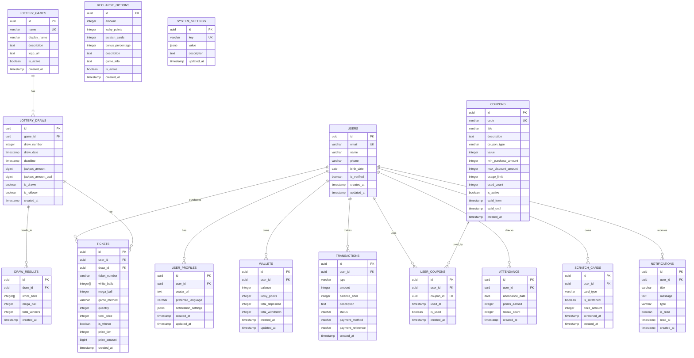

# Lucky Lotto Database ERD

## Entity Relationship Diagram

## 주요 테이블 설명

### 1. 사용자 관리
- **USERS**: 기본 사용자 정보 (이메일, 이름, 전화번호 등)
- **USER_PROFILES**: 사용자 프로필 (아바타, 언어 설정, 알림 설정)
- **WALLETS**: 지갑 정보 (잔액, 럭키 포인트, 입출금 내역)

### 2. 복권 게임 관리
- **LOTTERY_GAMES**: 복권 게임 종류 (메가밀리언, 파워볼)
- **LOTTERY_DRAWS**: 추첨 회차 정보 (회차 번호, 추첨일, 마감일, 당첨금)
- **DRAW_RESULTS**: 추첨 결과 (당첨 번호, 당첨자 수)

### 3. 티켓 관리
- **TICKETS**: 복권 티켓 (선택한 번호, 구매 방법, 당첨 여부, 당첨 등급)

### 4. 거래 관리
- **TRANSACTIONS**: 모든 거래 내역 (입금, 출금, 구매, 당첨금)

### 5. 쿠폰 시스템
- **COUPONS**: 쿠폰 정보 (코드, 제목, 할인/포인트 값, 유효기간)
- **USER_COUPONS**: 사용자별 쿠폰 사용 내역

### 6. 충전 시스템
- **RECHARGE_OPTIONS**: 충전 옵션 (금액, 럭키 포인트, 스크래치 카드)

### 7. 이벤트 시스템
- **ATTENDANCE**: 출석체크 (출석일, 연속 출석 일수, 획득 포인트)
- **SCRATCH_CARDS**: 스크래치 카드 (카드 종류, 당첨 금액, 스크래치 여부)

### 8. 알림 및 설정
- **NOTIFICATIONS**: 사용자 알림 (제목, 메시지, 읽음 여부)
- **SYSTEM_SETTINGS**: 시스템 설정 (키-값 형태의 설정)

## 주요 기능

### 1. 사용자 인증 및 프로필
- 이메일 기반 회원가입/로그인
- 사용자 프로필 관리
- 지갑 시스템 (잔액, 럭키 포인트)

### 2. 복권 구매 시스템
- 메가밀리언/파워볼 게임 지원
- 수동/자동/퀵픽 구매 방법
- 회차별 추첨 정보 관리

### 3. 당첨 확인 시스템
- 자동 당첨 확인 함수
- 당첨 등급별 상금 계산
- 당첨금 자동 지급

### 4. 결제 시스템
- 다양한 충전 옵션
- 럭키 포인트 적립
- 거래 내역 추적

### 5. 이벤트 시스템
- 쿠폰 발급 및 사용
- 출석체크 포인트 적립
- 스크래치 카드 게임

### 6. 보안 및 권한
- Row Level Security (RLS) 적용
- 사용자별 데이터 접근 제한
- 공개 데이터와 개인 데이터 분리

## 데이터베이스 함수

### 1. `update_wallet_balance()`
- 지갑 잔액 업데이트
- 거래 내역 자동 기록

### 2. `check_ticket_winning()`
- 티켓 당첨 여부 확인
- 당첨 등급 자동 계산

## 인덱스 최적화
- 사용자별 데이터 조회 최적화
- 복권 게임별 데이터 조회 최적화
- 거래 내역 조회 최적화
- 알림 조회 최적화
